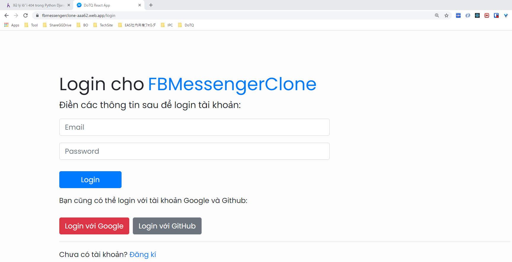
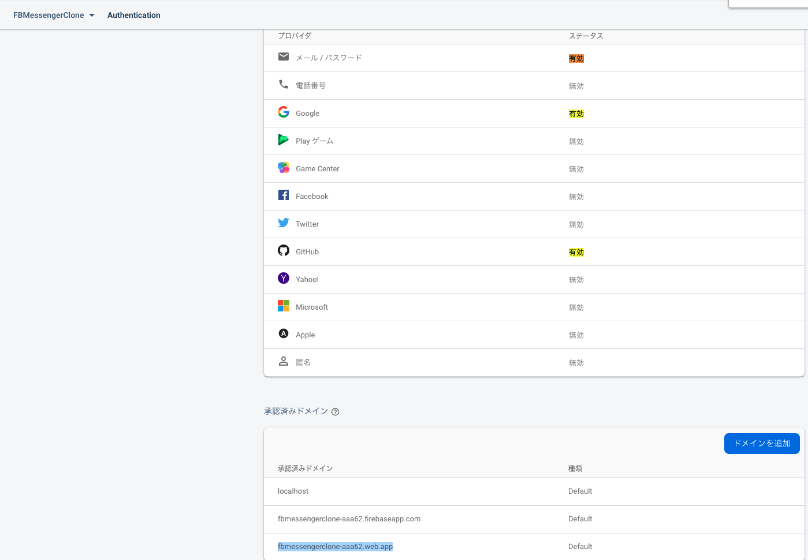
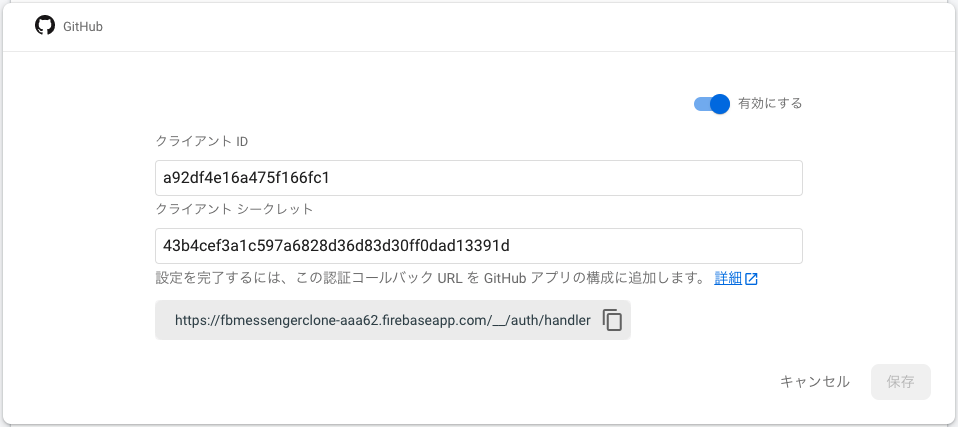
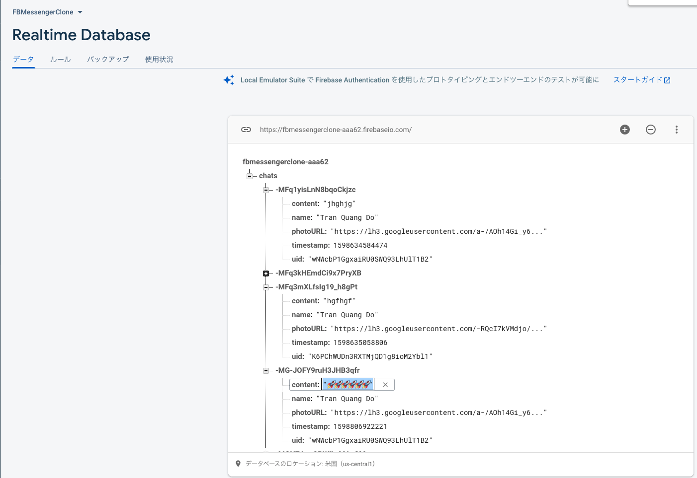
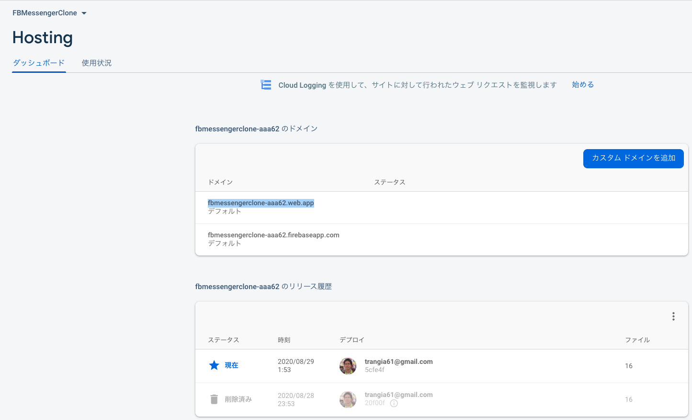

# react-firebase-fbmessenger-clone 🚀

## FB

### authentication

***************

### db

### hosting

### commands
1. `npm install -g firebase-tools`
2. `firebase login`
-> đã login với acc: trangia61@gmail.com
3. `firebase init`
-> có thể chọn deploy: API function or DB...
4. `npm run build`
5. `cd build/`
6. `firebase init`: chọn hosting > chọn folder="build"
7. `firebase deploy`
